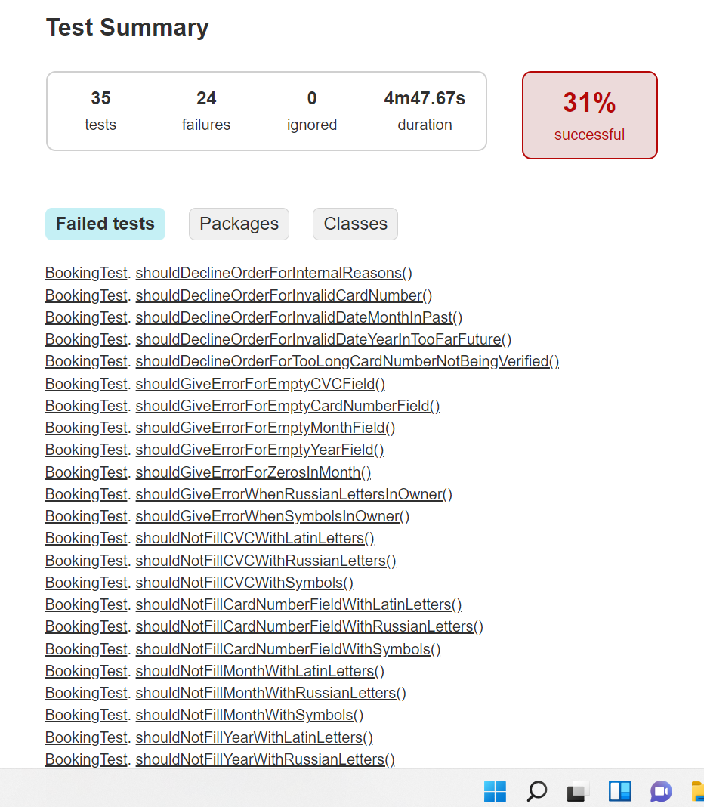
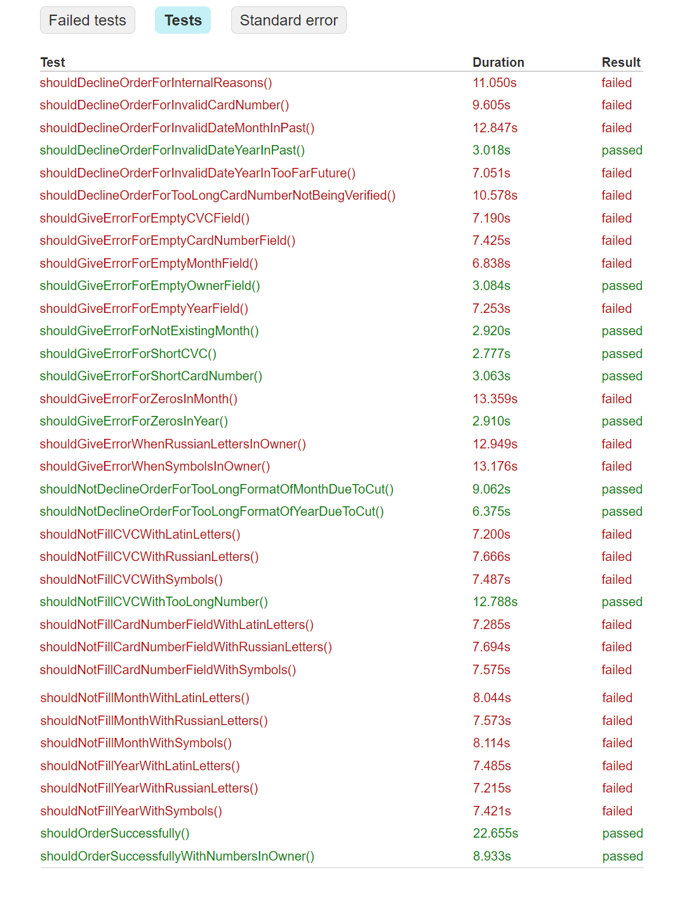

<h1>Отчетность по итогам тестирования</h1>

В ходе выполнения тестирования был найден ряд ошибок, влияющих на работу приложения: одна блокирующая (Бл), две
критические ошибки(Кр), три незначительные(незн). По типам ошибки делятся на: одна контентная(конт), две функциональные (Ф),
три логические(лог).

* Успешная отправка формы с "00" в поле месяц (Лог, Кр)
* Не появляется сообщение о том, что банк отклонил запрос, когда в поля введены валидные данные отклоненной карты(Ф, Бл)
* Успешная отправка формы с буквами кириллицы в поле Владелец(Лог, незн)
* Успешная отправка формы с символьными знаками в поле Владелец(Лог, незн)
* Появляется ошибка при отправке пустого поля Владелец(Ф, кр)
* Неинформативное сообщение об ошибке в полях номер карты/месяц/год/cvc при отправке пустого поля (Конт, незн)

Было выполнено 35 функциональных тестов. 24 упал (60%), 11 прошли (31%). Проблема в одном из упавших тестов () появилась
из-за проверки в январе (первом месяце года) - невозможно проверить предыдущий месяц в этом году, т.к. его нет. Следует
перепроверить этот тест в следующем месяце, чтобы убедиться, что это не дефект разработки.
Приложение корректно взаимодействует с СУБД, выполняет основные функции.

Рекомендуется исправить критические и блокирующие ошибки для корректного функционирования приложения. 
Рекомендуется так же убрать поле Владелец или сделать его необязательным для заполнения, поскольку 
большинство банковских систем не требуют заполнения этого поля, а у некоторых карт его и вовсе нет. Ошибка с
неинформативным текстом ошибки пустого поля может ввести пользователя в заблуждение.

* [Подробные отчеты о тестировании находятся в папке reportFiles в разделе documentation](https://github.com/ElizavetaShkryabiy/CourseWork-TourBooking/tree/master/documentation/reportFiles)

<h3>Краткий отчет о тестировании:</h3>

